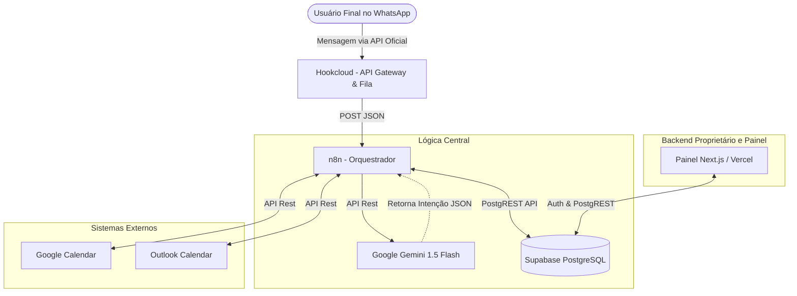

# Visão Geral da Arquitetura (SaaS Multi-tenant)

## 1. Princípios Arquiteturais

A solução foi projetada sob o princípio de **alta coesão, baixo acoplamento e resiliência**. Atendendo a requisitos de uma operação SaaS B2B, a arquitetura garante:
1. **Isolamento de Inquilinos (Tenants):** Dados segmentados logicamente usando *Row Level Security (RLS)* no banco de dados.
2. **Economia de LLM (Token Economy):** A IA atua estritamente como processador semântico (NLU), não como mecanismo de busca ou formatação.
3. **Resiliência a Falhas:** Webhooks e eventos processados de forma assíncrona com políticas de retentativa rigorosas.

## 2. Diagrama de Blocos (C4 Model - Nível Contêiner)

## 3. Stack Tecnológica Principal

*   **Banco de Dados & Autenticação:** Supabase (PostgreSQL). Atua como BaaS, resolvendo Autenticação, Banco de Dados Relacional e APIs RESTful auto-geradas. O uso de RLS é mandatório para todas as tabelas.
*   **Orquestração & Lógica de Negócios (Motor do Agente):** n8n. Hub central responsável pelo roteamento das mensagens, integração com IA e cálculo da matriz de horários livres via JavaScript.
*   **Inteligência Artificial (Cérebro Semântico):** Google Gemini 1.5. Utilizado no modo *Structured Output / JSON Mode* para NLP rápido e barato.
*   **Mensageria e Gatilhos:** 
    *   Hookcloud: Serviço responsável por prover integração direta com a API Oficial da Meta (WhatsApp). Atua como gateway de entrada e saída de mensagens e também como *buffer* (message broker simplificado) garantindo retentativas e entrega segura ao n8n em caso de picos de acesso.
*   **Frontend Administrativo:** Next.js (React), estilizado com TailwindCSS v4 e componentes Shadcn/ui para construção modular, rápida e focada em performance (Server Components).
